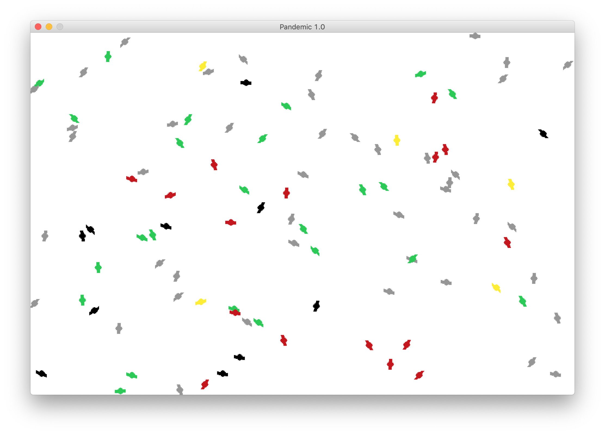
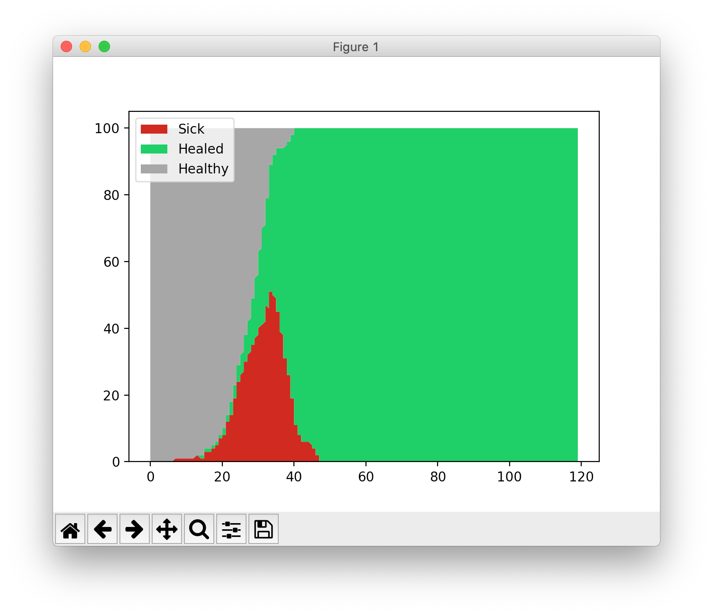
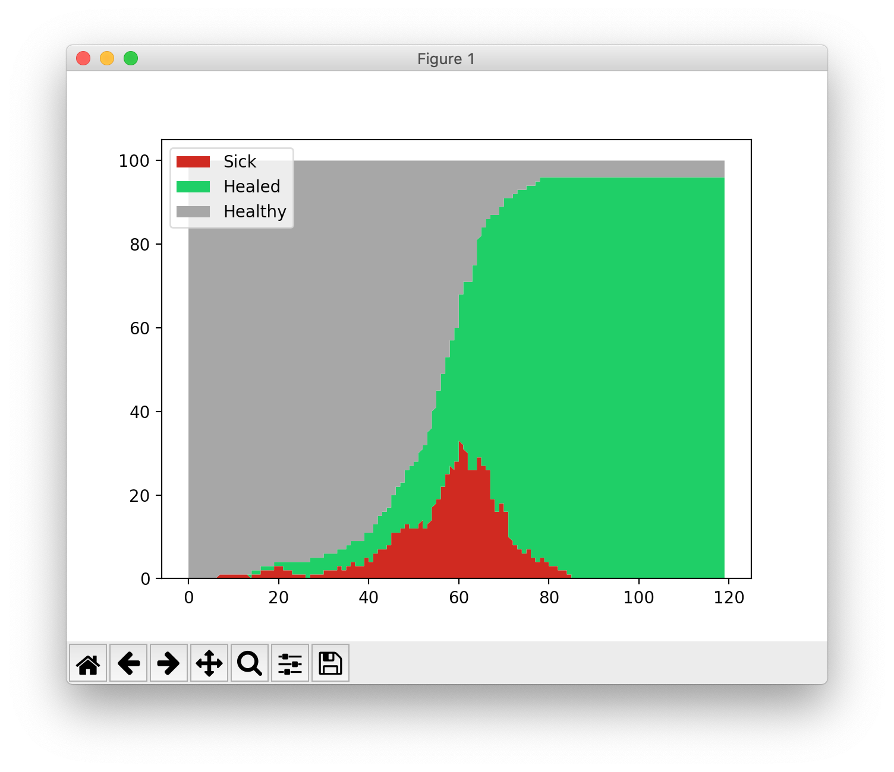
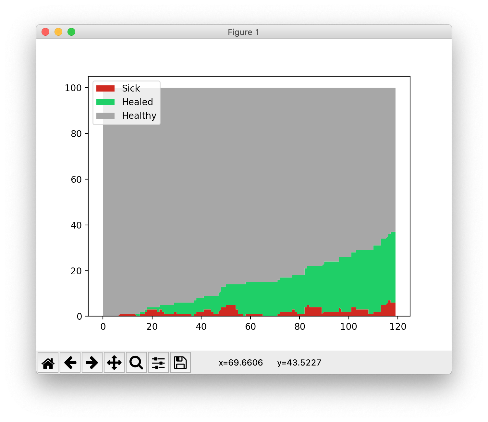

# Pandemic
A visual simulation of a pandemic spreading with and without social distancing.
This project has been inspired by this [Washington post article](https://www.washingtonpost.com/graphics/2020/world/corona-simulator/).

In order to run the simulation, just type this command into a terminal:
```
python3 pandemic_simulation.py
```










### Dependencies

* Python 3.7.3 or later
* pygame (```pip install pygame```)
* pandas (```pip install pandas```)
* matplotlib (```pip install matplotlib```)


